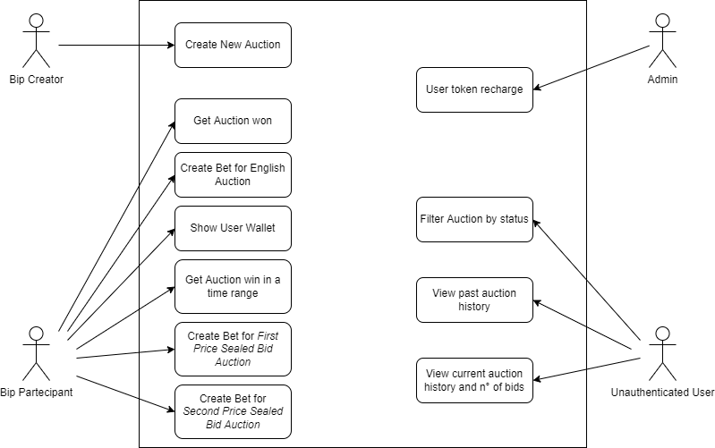
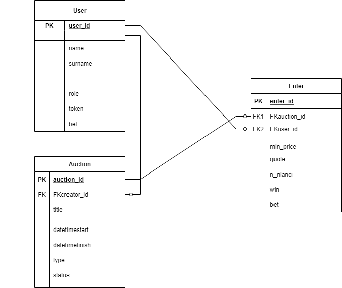
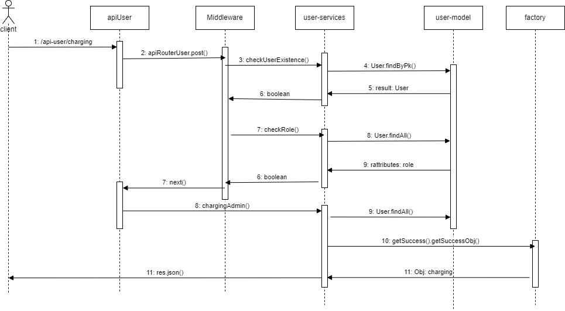

# Progetto Programmazione Avanzata
  Miccini, Pesaresi
  
## Obiettivo del progetto
Back-end per la realizzazione di un servizio che consente di gestire delle ast di vario tipo:
* Asta inglese aperta
* Asta in busta chiusa e pagamento del prezzo più alto, nella quale gli offerenti inseriscono la loro offerta in una busta sigillata e la consegnano al banditore. L’individuo con l’offerta più alta vince l’asta, pagando un prezzo pari all’ammontare offerto. 
* Asta in busta chiusa e pagamento del secondo prezzo più alto, con lo stesso funzionamento della precedente in cui, però, l’individuo con l’offerta più alta vince l’asta, pagando un prezzo pari al secondo ammontare offerto più alto.

In particolare, il sistema prevede la possibilità di:
* Creare una nuova asta
* Visualizzare l’elenco delle aste filtrando per non ancora aperte, in esecuzione, terminate
* Visualizzare da parte di un utente il proprio credito residuo
* Visualizzare lo storico delle aste alle quali si è partecipato
* Visualizzare lo storico delle aste alle quali si sta partecipando listando tutti gli eventuali rilanci
* Ricaricare un dato utente da parte di un utente Admin
* Visualizzare lo storico delle aste alle quali si è partecipato distinguendo per quelle che sono state aggiudicate e no
* Visualizzare lo storico delle aste alle quali si è partecipato distinguendo per quelle che sono state aggiudicate e no, specificando un range temporale

## Progettazione

### Diagrammi UML 
#### Diagramma dei casi d'uso

Tramite un diagramma "Use case" sono rappresente le relazioni tra gli utenti e le sue richieste.
Esistono 3 tipo di utenti:
* Bip Creator, il quale ha accesso ad una rotta che consente di creare una nuova asta
* Admin, che può ricaricare il portafoglio di un dato utente
* Bip Partecipant, che può parteciare alle aste.

Non è, invece, necessaria alcuna autentificazione per accedere alle tre rotte sulla destra (visualizzare l'elenco delle aste filtrandole per lo stato, visualizzare lo storico delle aste cui si è partecipato/ si sta partecipando mostrando il numero di rilanci)

#### Schema ER

Il database è composto da 3 tabelle:
* USER: contiente tutte le informazioni relative all'utente ed ha come chiave primaria l'id dell'utente.
* AUCTION : contiene tutte le informazioni relative alle aste ed ha come chiama primaria l'id dell'asta, mentre la chiave esterna (che contiene informazioni riguardo il creatore dell'asta) fa riferimento allo user_id nella tabella User.
* ENTER: contiene informazioni aggiuntive e deriva dalla relazione molti a molti tra USER e AUCTION

### Diagramma delle sequenze

Vengono riportati alcuni diagrammi delle sequenze per descrivere una sequenza di azioni che vengono eseguita quando si accede ad una specifica rotta.
* **Chiamata GET /showtoken :**

* **Chiamata POST /CreateAuction :**

* **Chiamata POST /charging :**

### Pattern utilizzati
* **Singleton**, un modello di Creational Design Pattern che garantisce che una classe abbia una sola istanza, fornendo al contempo un punto di accesso globale a quest'ultima istanza. E' stato utilizzato per effettuare la connessione al database.

* **CoR and middleware**, un behavioral design pattern che consente di passare le richieste lungo una catena di gestori. Sono stati implementati degli strati middleware per ogni rotta del server. 

* **Fatory**, un Creational Design Pattern che fornisce un'interfaccia interfaccia per la creazione di oggetti in una superclasse, ma permette alle
sottoclassi di modificare il tipo di oggetti che verranno creati.

## Avvio del progetto

Clonare la repository e, dopo essersi posizionati nella cartella, eseguire il seguente comando per avviare Docker:
~~~
$ docker-compose up
~~~
A questo punto è possibile effettuare le richieste tramite cURL o Postman.

In particolare, le richieste possibili da effettuare sulla porta 8080 sono le seguenti:
|    TIPO        |ROTTA                          |TOKEN JWT     |
|----------------|-------------------------------|--------------|
|GET             |/api-user/showALLUser          |NO|
|GET             |/api-user/showONEUser          |NO|
|GET             |/api-user/show-token           |SI|
|GET             |/api-user/win                  |SI|
|GET             |/api-user/winNoData            |SI|
|GET             |/api-user/charging             |SI|
|POST            |/api-auction/create-auction       |SI|
|GET             |/api-auction/filter-auction       |NO|
|GET             |/api-auction/show-all-auction     |NO|
|GET             |/api-auction/closed-auction       |NO|
|GET             |/api-auction/open-auction         |NO|
|POST            |/api-enter/bet                    |SI|
|GET             |/api-enter/show-rilanci           |SI|
|POST            |/api-enter/bet-close              |SI|

**Creare un'asta /api-auction/create-auction**
Tramite questa richiesta è possibile creare una nuova asta e specificarne i parametri. 
~~~
Da effettuare richiesta HTTP con Content-Type:'application/json' nell'header e payload JSON con la seguente struttura:
{
    "auction_id": 10,
    "title": "Asta immobiliare",
    "fkcreator_id": "T06x323aWb",
    "type": 3,
    "datetimestart": "2023-01-07T09:00:00+01:00",
    "datetimefinish": "2023-01-10T09:00:00+01:00",
    "status": 0
}
~~~

Lo status di un'asta può essere:
* 0: Futura, non ancora aperta
* 1: Terminate
* 2: Attuali, non ancora terminate
Mentre il type può essere:
* 1: Asta inglese aperta
* 2: Asta in busta chiusa e pagamento del prezzo più alto
* 3: Asta in busta chiusa e pagamento del secondo prezzo più alto

**Filtrare asta /api-auction/filter-auction**
Tramite questa richiesta è possibile visualizzare l’elenco delle aste filtrando per lo status. 
~~~
Da effettuare richiesta HTTP con Content-Type:'application/json' nell'header e payload JSON con la seguente struttura:
{
  "status": 0
}
~~~

**Visualizzare lo storico delle aste /api-auction/closed-auction**
Tramite questa richiesta è possibile visualizzare lo storico delle aste alle quali si è partecipato.
~~~
Da effettuare richiesta HTTP con Content-Type:'application/json' nell'header e payload JSON con la seguente struttura:
{
  "user_id": "4p0KF0xkOi"
}
~~~

**Visualizzare le aste attuali /api-auction/open-auction**
Tramite questa richiesta è possibile visualizzare lo storico delle aste alle quali si sta partecipando listando tutti gli eventuali rilanci.
~~~
Da effettuare richiesta HTTP con Content-Type:'application/json' nell'header e payload JSON con la seguente struttura:
{
  "user_id": "4p0KF0xkOi"
}
~~~

**Visualizzare token /api-user/show-token**
Tramite questa richiesta si da la possibilità all’utente di verificare il proprio credito residuo.
~~~
Da effettuare tramite token JWT che deve contenere un payload JSON con la seguente struttura:
{
  "user_id": "4p0KF0xkOi"
}
~~~

**Ricaricare un utente /api-user/charging**
Tramite questa richiesta si consente ad un utente admin di ricaricare un dato utente. 
~~~
Da effettuare tramite token JWT che deve contenere un payload JSON con la seguente struttura:
{
  "user_id": "4p0KF0xkOi",
  "token": 500
}
~~~
In token si specifica la quantità di token da caricare nel portafoglio dell'utente.

**crea un'offerta per un'asta in busta aperta /api-enter/bet**
~~~
Da effettuare tramite token JWT che deve contenere un payload JSON con la seguente struttura:
{
  "user_id": "4p0KF0xkOi",
  "auction_id": 2,
  "token": 500
}
~~~
**crea un'offerta per un'asta in busta chiusa /api-enter/betClose
### Aste vinte e non

